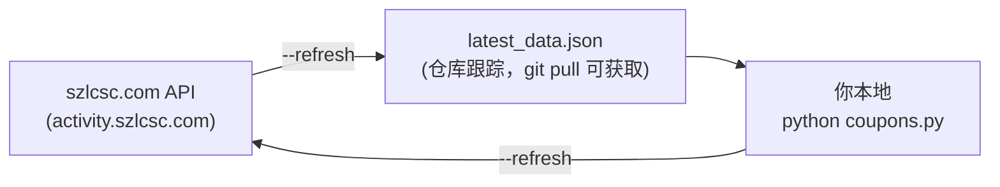

# szlcsc-coupons · 立创商城优惠券助手

> 终端里的立创商城领券神器 — 专为电子爱好者打造的优惠券分析工具

<p align="center">
  
  
  
  
  
</p>

---

## 🎯 为什么需要这个工具？

立创商城（szlcsc.com）每单（指绑定订单，不算首单的话）最多可叠加 **10 张优惠券**。品牌推广区的券大多为 **满16减15**，即花 ¥16 买元件，券抵扣 ¥15，实付 ¥1。

> [!TIP]
> **理论上**：领 10 张品牌券 → 买 ¥160 的元件 → 用券抵扣 ¥150 → **实付 ¥10**。

但品牌推广区有 **550+ 张券**，如果手动翻页对比太慢。这个工具可以帮助快速分析和浏览优惠券，帮你发现哪些券最值、怎么组合最省。

---

## 特性一览

### ✨ 核心功能
| 命令 | 说明 |
|---|---|
| `▶️ python coupons.py` | 默认模式 — 7 个专区分区展示 + 折扣率排行榜 |
| `📊 python coupons.py --sort rate` | 按折扣率排序（满16减15 → 93.8% 排最前） |
| `🔍 python coupons.py --min-rate 80` | 只看折扣率 ≥ 80% 的黄金券 |
| `🏷️ python coupons.py --brand 捷而瑞` | 筛选指定品牌/关键词 |
| `📂 python coupons.py --section 2` | 只看某个专区（品牌推广、工业品等） |
| `🧪 python coupons.py --combo` | 10 张券叠加分析 — 算购买力倍率 ⚠️ [实验性] |
| `🧪 python coupons.py --combo 100` | 带预算模拟（¥100 预算能买多少？） ⚠️ [实验性] |
| `📈 python coupons.py --stats` | 汇总统计（券总数、有效期、类型分布） |
| `🔄 python coupons.py --diff` | 对比上次运行，看新增/下架/数量波动 |
| `📦 python coupons.py --export data.csv` | 导出全部数据为 CSV |
| `🔄 python coupons.py --refresh` | 强制从立创 API 拉取最新数据 |
| `⏰ python coupons.py --max-age-hr 48` | 本地数据 48 小时内不提示更新 |

### 🎨 视觉反馈
- 折扣率颜色编码： ·  ·  · 
- 已领人数着色： · 
- 分类 + 格式化表格

---

## 🚀 快速开始

```bash
# 1. 克隆
git clone https://github.com/ResAlexander/szlcsc-coupons.git
cd szlcsc-coupons

# 2. 安装依赖
pip install rich

# 3. 运行（首次会自动拉取数据）
python coupons.py
```


## 🔄 数据流



> [!NOTE]
> 用户运行时，默认读取仓库里的 `latest_data.json`。如果超过 24 小时未更新，程序会询问是否 `git pull` 拉取最新数据。<br>
> 不论时间多久，`--refresh` 直接从 szlcsc API 拉最新数据并写入本地。

---

## 📖 使用示例

### 👁️ 默认视图 — 7 个专区全览

```
python coupons.py
```

按已领人数排序显示综合专区、品牌推广专区（550+ 张）、工业品专区、PLUS 专区、超级品牌周、超级会员日、面板定制专区。

### 🏆 找到性价比最高的券

```bash
# 折扣率排行，只看前 30
python coupons.py --sort rate --top 30

# 只看 80% 折扣率以上的（满16减15这类）
python coupons.py --min-rate 80
```

### 🧪 10 张券叠加分析 [实验性]

> [!WARNING]
> **实验性功能**：叠加逻辑尚未考虑品牌互斥、券类型互斥等规则，结果仅供参考。

```bash
# 自动找最优 10 张券，算购买力
python coupons.py --combo

# 带预算模拟：¥100 能买多少？
python coupons.py --combo 100
```

<details>
<summary>📊 输出示例</summary>

```
   最优 10 张商品券叠加分析
┌─────┬────────────────────┬────────┬───────┬───────┬───────┐
│   # │ 优惠券名称          │ 折扣率 │  门槛 │  面额 │ 实付  │
├─────┼────────────────────┼────────┼───────┼───────┼───────┤
│   1 │ 15元松田品牌商品券     │ 93.8% │  ¥16 │  ¥15 │   ¥1 │
│   2 │ 15元台舟品牌商品券     │ 93.8% │  ¥16 │  ¥15 │   ¥1 │
│  ...│ ...                │ ...    │ ...   │ ...   │ ...   │
├─────┼────────────────────┼────────┼───────┼───────┼───────┤
│     │ 商品总价值           │        │ ¥160  │       │       │
│     │ 券抵扣总额           │        │       │ ¥150  │       │
│     │ 实际需支付           │        │       │       │  ¥10  │
│     │ 购买力倍率           │        │   16.0x (花¥1买¥16) │
└─────┴────────────────────┴────────┴───────┴───────┴───────┘
```
</details>

### 🔄 变化追踪

```bash
python coupons.py --diff
```

显示新增券、已下架券、已领数量的环比变化。适合每天跑一次，发现新羊毛。


---

## 🛠️ 技术栈

<p>
  
  
  
</p>

| 层 | 技术 |
|---|---|
| 🧠 语言 | **Python 3.9+** — 标准库为主，零外部依赖 |
| 🎨 终端 UI | **[Rich](https://github.com/Textualize/rich)** — 表格、着色、面板、进度动画 |
| 🌐 数据源 | `activity.szlcsc.com` 公开接口（无需登录） |

---

## 💡 叠券小贴士

> [!IMPORTANT]
> 立创优惠券关键规则：

- ✅ 品牌券之间可以互相叠加，数量不限
- ⛔ 同一品牌只能用一张
- ⛔ 商品优惠券和折扣券互不叠加
- ✅ 运费券和商品券可以叠加

**推荐策略** 🎯

1. **筛选黄金券** → `--min-rate 90` 找出满16减15/满21减20 这类高折扣券
2. **组合优化** → `--combo` 看 10 张叠加效果 [实验性]
3. **避坑** → 避开门槛过高（满500减50 实际折扣率 10%）的券
4. **持续监控** → 跑一遍 `--diff`，查看新的优惠券

---

## 📄 协议

<p>
  
</p>

MIT License — 详见 `LICENSE` 文件
